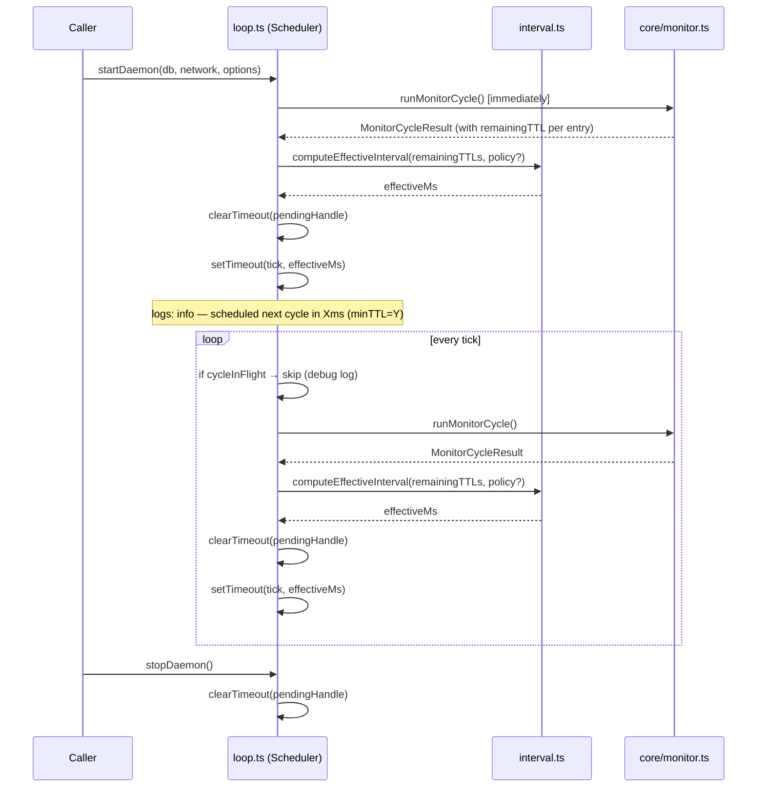

# Design Document — Adaptive Polling Intervals

## Overview

The Sorokeep daemon currently schedules monitoring cycles at a fixed interval. This design replaces
that static schedule with an **adaptive schedule**: after every cycle the Scheduler inspects the
minimum remaining TTL across all watched entries and picks the next interval from a four-tier table.
Entries with comfortable TTLs are checked infrequently; entries within their final hour are checked
every minute.

The change is surgical: all new logic lives inside `src/daemon/loop.ts` (and a new companion module
`src/daemon/interval.ts` for the pure computation). The public API of `startDaemon` / `stopDaemon`
is preserved and extended backward-compatibly. Existing users who pass `intervalMs` get exactly the
same behaviour as today.

### Key design goals

1. **Correct under all inputs** — the interval must always respect its floor and ceiling regardless
   of what TTL data the RPC returns.
2. **Testable in isolation** — the tier calculation is a pure function that can be unit-tested and
   property-tested without starting the daemon.
3. **Zero observable regression** — `intervalMs` as a scalar override continues to disable adaptive
   logic entirely.
4. **Observability by default** — every rescheduling decision emits a structured log entry.

---

## Architecture

The adaptive polling feature introduces one new module and modifies two existing ones.

```
src/
  daemon/
    interval.ts        ← NEW  — pure computeEffectiveInterval function + types
    loop.ts            ← MOD  — Scheduler wires interval.ts into the timing loop
  utils/
    config.ts          ← MOD  — SorokeepConfig picks up optional IntervalPolicy
```

### Scheduling flow (after this change)



### Timer strategy change: `setInterval` → `setTimeout`

The current code uses `setInterval` for a fixed-period loop. Adaptive intervals require that the
delay be recomputed after each cycle, so the implementation switches to a **chain of `setTimeout`
calls**. After each cycle completes, the Scheduler:

1. Calls `computeEffectiveInterval` with the TTLs from the just-finished cycle.
2. Clears any existing pending timer.
3. Schedules a single `setTimeout` with the new delay.

This naturally prevents timer drift and makes the "at most one pending timer" invariant trivially
verifiable.

---

## Components and Interfaces

### `src/daemon/interval.ts` — new module

This module owns all interval arithmetic. It is a pure TypeScript module with no side effects, no
imports from `logging/`, and no I/O.

```typescript
// ─── Tier boundaries (in ledgers) ────────────────────────────────────────────
// 1 ledger ≈ 5 seconds on Stellar mainnet / testnet
export const TTL_TIER_CRITICAL  =   720;   // ≤ 1 hour  (~720 ledgers)
export const TTL_TIER_DAY       = 17_280;  // ≤ 24 hrs  (~17,280 ledgers)
export const TTL_TIER_WEEK      = 120_960; // ≤ 7 days  (~120,960 ledgers)

// ─── Default interval values (ms) ────────────────────────────────────────────
export const DEFAULT_MIN_INTERVAL_MS =      60_000; // 1 minute
export const DEFAULT_MAX_INTERVAL_MS = 3_600_000;   // 1 hour

export const DEFAULT_INTERVAL_CRITICAL_MS =   60_000; // < 720 ledgers
export const DEFAULT_INTERVAL_DAY_MS       =  300_000; // 720–17,279 ledgers
export const DEFAULT_INTERVAL_WEEK_MS      =  300_000; // 17,280–120,959 ledgers
export const DEFAULT_INTERVAL_SAFE_MS      = 3_600_000; // ≥ 120,960 ledgers

// ─── IntervalPolicy type ──────────────────────────────────────────────────────

/**
 * Configures the adaptive tier table.
 * All interval fields are in milliseconds; all TTL fields are in ledgers.
 * Omitted fields fall back to built-in defaults.
 */
export interface IntervalPolicy {
    /** Floor below which no interval will ever be scheduled. Default: 60_000 ms. */
    minIntervalMs?: number;
    /** Ceiling above which no interval will ever be scheduled. Default: 3_600_000 ms. */
    maxIntervalMs?: number;

    /** Interval when remaining TTL < criticalTtlLedgers. Default: 60_000 ms. */
    criticalIntervalMs?: number;
    /** Interval when criticalTtlLedgers ≤ TTL < dayTtlLedgers. Default: 300_000 ms. */
    dayIntervalMs?: number;
    /** Interval when dayTtlLedgers ≤ TTL < weekTtlLedgers. Default: 300_000 ms. */
    weekIntervalMs?: number;
    /** Interval when TTL ≥ weekTtlLedgers. Default: 3_600_000 ms. */
    safeIntervalMs?: number;

    /** Lower TTL tier boundary (ledgers). Default: 720. */
    criticalTtlLedgers?: number;
    /** Middle TTL tier boundary (ledgers). Default: 17_280. */
    dayTtlLedgers?: number;
    /** Upper TTL tier boundary (ledgers). Default: 120_960. */
    weekTtlLedgers?: number;
}

// ─── Public API ───────────────────────────────────────────────────────────────

/**
 * Compute the effective polling interval in milliseconds from an array of
 * remaining TTL values (in ledgers).
 *
 * Pure function: no side-effects, deterministic, safe to call in tests.
 *
 * @param remainingTTLs - Remaining TTL in ledgers for each watched entry.
 *                        Empty array → returns maxIntervalMs.
 * @param policy        - Optional override for tier boundaries and intervals.
 * @returns             - Millisecond interval clamped to [minIntervalMs, maxIntervalMs].
 */
export function computeEffectiveInterval(
    remainingTTLs: number[],
    policy?: IntervalPolicy,
): number;

/**
 * Validate an IntervalPolicy before the daemon starts.
 * Throws a descriptive Error for any validation violation.
 * No-ops for undefined / null policies.
 */
export function validateIntervalPolicy(policy: IntervalPolicy | undefined): void;

/**
 * Classify a single remaining TTL value into its tier interval (ms).
 * Internal helper exposed for testing and documentation purposes.
 */
export function ttlToIntervalMs(
    remainingTTL: number,
    policy?: IntervalPolicy,
): number;
```

#### `computeEffectiveInterval` algorithm

```
resolve all tier parameters (merge policy over defaults)

if remainingTTLs is empty → return maxIntervalMs

for each ttl in remainingTTLs:
    if ttl < criticalTtlLedgers → tier = criticalIntervalMs
    else if ttl < dayTtlLedgers → tier = dayIntervalMs
    else if ttl < weekTtlLedgers → tier = weekIntervalMs
    else → tier = safeIntervalMs

effectiveMs = min(all tier values)
return clamp(effectiveMs, minIntervalMs, maxIntervalMs)
```

#### `validateIntervalPolicy` rules

| Rule | Error message pattern |
|------|-----------------------|
| Any tier interval < 10,000 ms | `IntervalPolicy: {field} must be ≥ 10,000 ms (got {value})` |
| minIntervalMs > any tier interval | `IntervalPolicy: minIntervalMs ({value}) exceeds tier interval {field} ({tierValue})` |

Validation is called once inside `startDaemon`, before the first cycle runs.

---

### Changes to `DaemonOptions` in `src/daemon/loop.ts`

```typescript
export interface DaemonOptions {
    /**
     * Fixed polling interval in milliseconds.
     * When supplied, adaptive behaviour is disabled: this value is used as
     * both minIntervalMs and maxIntervalMs, producing a constant interval.
     * Preserved for backward compatibility.
     */
    intervalMs?: number;

    /** Adaptive interval policy. Ignored when intervalMs is also supplied. */
    intervalPolicy?: IntervalPolicy;

    /** Optional RPC endpoint URL override. */
    rpcUrl?: string;

    /** How frequently to run vacuum maintenance. Defaults to 24 hours. */
    vacuumIntervalMs?: number;

    /** Called after every cycle with the result (or null + error on failure). */
    onCycle?: (result: MonitorCycleResult | null, error?: Error) => void;
}
```

#### Backward-compatibility rule

When `intervalMs` is present, the Scheduler synthesises a degenerate `IntervalPolicy` with
`minIntervalMs = maxIntervalMs = intervalMs`. Because `clamp(x, N, N) = N` for all x, the
adaptive logic always returns `intervalMs`, exactly matching current behaviour.

---

### Module-level state changes in `loop.ts`

| Current | After change |
|---------|--------------|
| `intervalHandle: ReturnType<typeof setInterval>` | `timeoutHandle: ReturnType<typeof setTimeout>` |
| `cycleInFlight: boolean` | unchanged |
| `vacuumIntervalMs`, `lastVacuumAt` | unchanged |
| *(nothing)* | `currentEffectiveMs: number` — last successfully computed interval, used as fallback on error |
| *(nothing)* | `activePolicy: IntervalPolicy \| undefined` — resolved policy stored at `startDaemon` time |

---

## Data Models

### `IntervalPolicy` (defined in `interval.ts`, re-exported from `loop.ts`)

All fields optional; unset fields fall back to documented defaults.

```
IntervalPolicy {
    minIntervalMs?:        number   // ≥ 10_000 ms enforced; default: 60_000
    maxIntervalMs?:        number   // ≥ minIntervalMs enforced; default: 3_600_000
    criticalIntervalMs?:   number   // TTL < criticalTtlLedgers; default: 60_000
    dayIntervalMs?:        number   // TTL in [critical, day); default: 300_000
    weekIntervalMs?:       number   // TTL in [day, week); default: 300_000
    safeIntervalMs?:       number   // TTL ≥ weekTtlLedgers; default: 3_600_000
    criticalTtlLedgers?:   number   // default: 720
    dayTtlLedgers?:        number   // default: 17_280
    weekTtlLedgers?:       number   // default: 120_960
}
```

### `remainingTTLs` extraction

`runMonitorCycle` already stores `remainingTTL` on each `SorokeepLedgerEntryResult` that is
returned from the RPC client. After the monitor cycle completes, `loop.ts` will collect the TTLs
by iterating the entries it receives back from the cycle result.

Because `MonitorCycleResult` currently does not carry entry-level TTLs, a minimal extension is
needed:

```typescript
export interface MonitorCycleResult {
    // ... existing fields unchanged ...

    /**
     * Remaining TTL values (in ledgers) for all entries successfully updated
     * in this cycle. Used by the Scheduler to compute the next interval.
     * Empty when no entries were updated or the cycle failed.
     */
    remainingTTLs?: number[];
}
```

This is a non-breaking addition (new optional field with sensible default `[]`).

---

## Correctness Properties

*A property is a characteristic or behavior that should hold true across all valid executions of a
system — essentially, a formal statement about what the system should do. Properties serve as the
bridge between human-readable specifications and machine-verifiable correctness guarantees.*

### Property 1: Tier mapping correctness

*For any* non-empty array of remaining TTL values (in ledgers) and any valid `IntervalPolicy`, each
individual TTL must be classified into exactly the tier whose boundary it falls within, and the
result must equal the minimum of all per-entry tier intervals before clamping.

**Validates: Requirements 1.1, 1.2, 3.2**

### Property 2: Range invariant

*For any* array of remaining TTL values (including the empty array) and any valid `IntervalPolicy`,
the value returned by `computeEffectiveInterval` must satisfy
`minIntervalMs ≤ result ≤ maxIntervalMs`.

**Validates: Requirements 1.3, 1.4, 1.5, 4.2, 4.3**

### Property 3: Purity and determinism

*For any* array of remaining TTL values and optional policy, calling `computeEffectiveInterval`
twice with identical arguments must return identical results — no hidden state, no side-effects.

**Validates: Requirements 4.4**

### Property 4: Uniform-array invariant

*For any* remaining TTL value `v` and any positive integer `n`, calling
`computeEffectiveInterval([v, v, ..., v])` (n copies of v) must return the same result regardless
of `n`.

**Validates: Requirements 4.5**

---

## Error Handling

### Configuration validation errors

`validateIntervalPolicy` is called synchronously at the top of `startDaemon`, before any async
work begins. If it throws, `startDaemon` re-throws the same error and no timer or cycle is ever
scheduled. The error message identifies the offending field and its value.

### Cycle errors — interval fallback

When `runMonitorCycle` throws or returns a non-empty `errors` array, the Scheduler:

1. Retains `currentEffectiveMs` — the interval computed from the previous successful cycle.
2. Schedules the next timer using `currentEffectiveMs` unchanged.
3. Logs the error count alongside the retained interval (see Observability below).

On startup, `currentEffectiveMs` is initialised to `maxIntervalMs` so that the first failed
cycle schedules the next cycle at the maximum interval rather than zero.

### RPC TTL data gaps

If an entry is not returned by the RPC (possibly archived), `remainingTTL` for that entry is not
included in the array. Missing entries are therefore invisible to the interval computation — they
do not push the interval toward zero, which is the conservative safe choice. The monitor already
logs a debug message for each missing entry.

### Negative or zero TTL values

`remainingTTL` can be zero or negative when a ledger entry has already expired (
`liveUntilLedgerSeq < latestLedger`). Values ≤ 0 fall into the critical tier (< 720 threshold) and
produce the minimum 60-second interval. No special-casing is needed beyond what the tier table
already provides.

---

## Observability

All scheduler log lines use the `DaemonLoop` component binding already established in `loop.ts`.

### Rescheduling log (info, every cycle)

```
Scheduler — next cycle in {effectiveMs}ms | minTTL={minRemainingTTL} ledgers | errors={errorCount}
```

When the interval changed relative to the previous cycle, append:

```
 | intervalChanged: {previousMs}ms → {effectiveMs}ms
```

### Empty watch list log (debug)

```
Scheduler — no TTL data available; using maxInterval={maxIntervalMs}ms
```

Emitted when `remainingTTLs` is empty (watch list is empty or all entries were missing from RPC).

### Re-entrance skip log (debug, existing)

The existing `"Skipping tick — previous cycle still in flight"` message is retained unchanged.

---

## Testing Strategy

### Dual testing approach

Unit tests cover specific examples, edge cases, and wiring. Property tests cover universal
invariants of the pure `computeEffectiveInterval` function.

### Property-based tests (`tests/daemon/interval.property.test.ts`)

The project uses **Vitest** with **fast-check** as the property-based testing library.

Install as a dev dependency:
```
fast-check@^3.x
```

Each property test is tagged with a comment referencing the design property:
```
// Feature: adaptive-polling-intervals, Property N: <property text>
```

Minimum **100 runs** per property (fast-check default is 100; configure with `{ numRuns: 100 }`).

#### Property 1 — Tier mapping correctness

Generate `remainingTTL` values in each tier range. For each generated value:
- TTL in `[0, TTL_TIER_CRITICAL)` → result must equal `criticalIntervalMs` (before clamping)
- TTL in `[TTL_TIER_CRITICAL, TTL_TIER_DAY)` → `dayIntervalMs`
- TTL in `[TTL_TIER_DAY, TTL_TIER_WEEK)` → `weekIntervalMs`
- TTL ≥ `TTL_TIER_WEEK` → `safeIntervalMs`

Also test: for arrays of mixed-tier TTLs, result equals the minimum of all per-entry tiers
(subject to clamping).

#### Property 2 — Range invariant

Use `fc.array(fc.integer({ min: -1000, max: 500_000 }))` to generate arbitrary TTL arrays
(including empty, including negative values). Assert:

```
result >= DEFAULT_MIN_INTERVAL_MS && result <= DEFAULT_MAX_INTERVAL_MS
```

#### Property 3 — Purity / determinism

Generate `fc.array(fc.nat())`. Call `computeEffectiveInterval(ttls)` twice. Assert results are
strictly equal (`===`).

#### Property 4 — Uniform-array invariant

Generate `fc.nat()` for value and `fc.integer({ min: 1, max: 50 })` for length. Call
`computeEffectiveInterval` with `Array(length).fill(value)`. Assert all results are equal.

### Unit tests (`tests/daemon/interval.test.ts`)

Concrete examples covering:
- Default tier boundaries (exactly at each boundary value)
- `intervalMs` scalar override disables adaptive logic
- `validateIntervalPolicy` rejects tier < 10,000 ms
- `validateIntervalPolicy` rejects minInterval > tier interval
- Empty array returns `maxIntervalMs`
- Negative TTL classified as critical tier

### Integration tests (`tests/daemon/loop.adaptive.test.ts`)

Extend the existing `loop.test.ts` pattern with mocked `runMonitorCycle`. Cover:
- Successful cycle: next `setTimeout` delay equals `computeEffectiveInterval(cycle.remainingTTLs)`
- Error cycle: next delay retains previous effective interval
- `intervalMs` override: delay is always `intervalMs` regardless of TTL data
- `intervalPolicy` custom tiers are used when supplied
- Interval-changed log entry is emitted when interval changes
- Empty watch list logs at debug level

### Existing tests

All existing tests in `tests/daemon/loop.test.ts` must continue to pass without modification.
The `setInterval` → `setTimeout` switch requires updating the loop.test.ts timer-advance tests
to use `vi.advanceTimersByTimeAsync` correctly for chained timeouts — Vitest handles these
identically.
